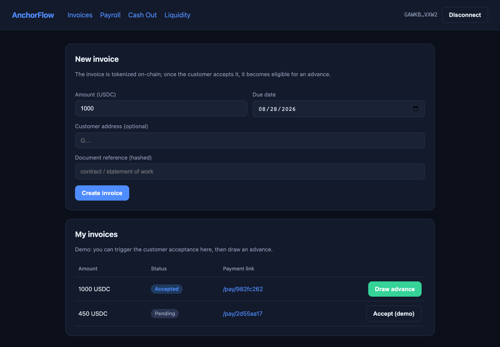
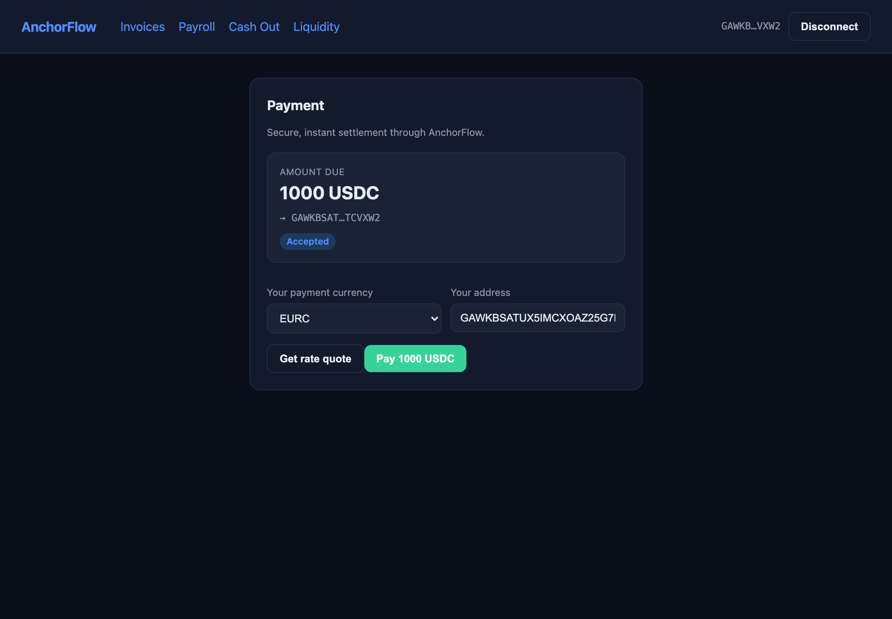
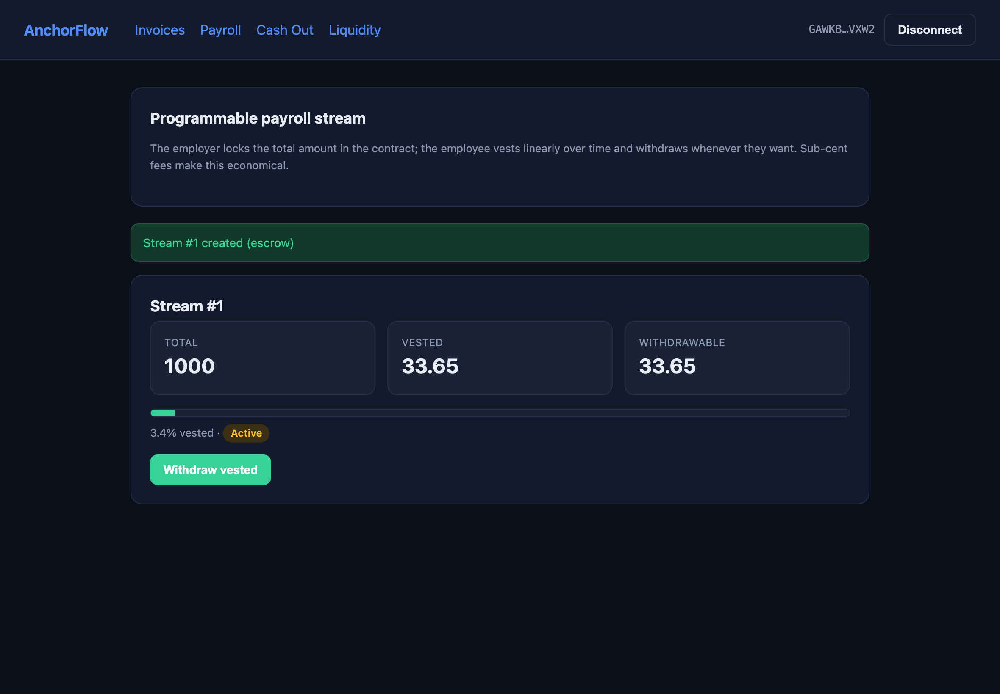
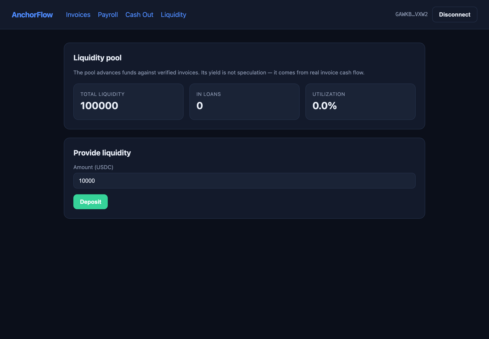
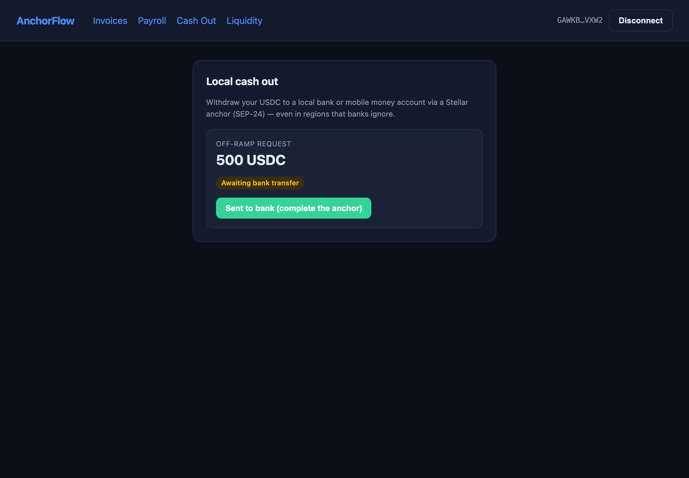
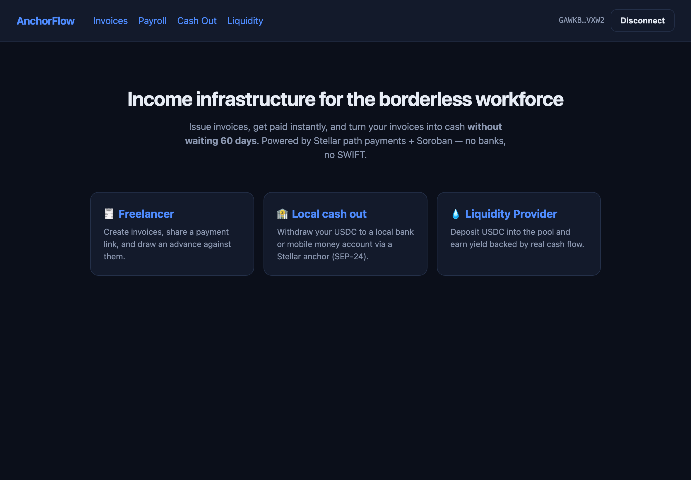

<div align="center">

# AnchorFlow

**Programmable cross-border treasury & invoice-financing rails for the global independent workforce.**

Income infrastructure for the borderless workforce — built on **Stellar** & **Soroban**.

[](#test--deploy-status)
[](docs/DEPLOYMENT.md)
[](https://stellar.expert/explorer/testnet/contract/CDFEEMA73R5H7IWQOOLUN4GM3FTE3B7I55CDNT7QI2EBRXOTQA7ILT3E)
[](LICENSE)

</div>

---

## What is AnchorFlow?

The independent economy is now hundreds of millions of people working across borders — yet the money rails beneath them are still built for banks and 3-day wires. A freelancer invoicing a client abroad loses **5–10%** to FX and fees, waits **3–7 days** to settle, gets paid **30–60 days late**, and — worst of all — **cannot borrow a cent** against a real, contractual receivable.

**AnchorFlow turns a single payment link into a full treasury stack:**

1. **Get paid in anything, receive what you want** — Stellar **path payments** route through the native DEX and settle into your chosen asset in ~5 seconds for less than a cent. No correspondent banks, no SWIFT.
2. **Cash out locally** — via Stellar **anchors** (SEP-24) you off-ramp straight to a local bank or mobile money.
3. **Tokenize the invoice, unlock the income** — every accepted invoice is minted as an RWA on **Soroban**; draw an **instant 80–90% advance** from a permissionless pool, and the smart contract **auto-settles** the loan when the client pays. LPs earn real cash-flow-backed yield.
4. **Programmable payroll** — Soroban contracts stream salary with linear vesting; contributors withdraw what they've earned anytime.

> **It's not another wallet — it's income infrastructure.** And Stellar's anchors, path payments, and Soroban are the only stack that makes it real today.

Full pitch: **[`docs/PITCH.md`](docs/PITCH.md)**

---

## Screenshots

| Freelancer — invoices & financing | Customer — pay (multi-currency) |
|---|---|
|  |  |

| Payroll streaming (live vesting) | Liquidity pool |
|---|---|
|  |  |

| Local cash out (anchor / SEP-24) | Landing |
|---|---|
|  |  |

---

## Architecture

```
Frontend (Next.js)        Backend (Node/TS)            Stellar / Soroban
 5 panels            ──►   ledger adapter        ──►    InvoiceToken   (RWA)
 invoice / payroll        sim ↔ live                    LendingPool    (advance + yield)
 cashout / pool / pay     path-payment builder          PayrollStream  (vesting)
                          SEP-24 anchor sim             native DEX     (path payments / FX)
```

Money and credit logic live **on-chain** (Soroban); UX convenience lives **off-chain** (backend). Design detail: **[`docs/ARCHITECTURE.md`](docs/ARCHITECTURE.md)**.

```
anchorflow/
├── contracts/            # Soroban (Rust)
│   ├── invoice-token/    # Invoice RWA token
│   ├── lending-pool/     # Advance + LP yield
│   └── payroll-stream/   # Programmable payroll (vesting)
├── packages/
│   ├── backend/          # Node + TS: orchestration, indexer, anchor sim
│   ├── frontend/         # Next.js: 5 panels
│   └── shared/
├── deployments/          # testnet contract IDs
└── docs/                 # PITCH · ARCHITECTURE · DEPLOYMENT · DEMO
```

---

## Live on Stellar Testnet

All three contracts are deployed and the full flow is **verified end-to-end on chain**.

| Contract | Contract ID | Explorer |
|---|---|---|
| InvoiceToken | `CDVXKOEZ7ZVXUUKEGUAF4GTS6WZOT3LRTR7PNHSVTAS42DEJ2IHDO7S5` | [view](https://stellar.expert/explorer/testnet/contract/CDVXKOEZ7ZVXUUKEGUAF4GTS6WZOT3LRTR7PNHSVTAS42DEJ2IHDO7S5) |
| LendingPool | `CDFEEMA73R5H7IWQOOLUN4GM3FTE3B7I55CDNT7QI2EBRXOTQA7ILT3E` | [view](https://stellar.expert/explorer/testnet/contract/CDFEEMA73R5H7IWQOOLUN4GM3FTE3B7I55CDNT7QI2EBRXOTQA7ILT3E) |
| PayrollStream | `CBUTHZNJDLAMQT55GEX2ZCZQTWMQCAM7CIWRFFULZNJBA6ULJ5V7MZOM` | [view](https://stellar.expert/explorer/testnet/contract/CBUTHZNJDLAMQT55GEX2ZCZQTWMQCAM7CIWRFFULZNJBA6ULJ5V7MZOM) |

Verified flow (1,000 USDC): LP deposits 10,000 → freelancer issues invoice → client accepts → **850 advance** → client pays → loan closes atomically → freelancer **980**, pool **10,020** (20 = LP yield). The numbers match across unit tests, backend sim, and live chain. See **[`docs/DEPLOYMENT.md`](docs/DEPLOYMENT.md)**.

---

## Quickstart

Requirements: Rust 1.95+, `stellar` CLI 26+, Node 22+.

```bash
# 1. Contracts — build + test
cd contracts
cargo test                 # 16/16
stellar contract build     # deployable wasm

# 2. Backend (sim mode — no network needed)
cd ../packages/backend
npm install && npm run dev  # http://localhost:3001

# 3. Frontend
cd ../frontend
npm install && npm run dev  # http://localhost:3000
```

Drive the whole financing flow locally: `./scripts/smoke_backend.sh`. Judge demo runbook: **[`docs/DEMO.md`](docs/DEMO.md)**.

---

## Test & deploy status

- **29/29 tests passing** — `contracts/` **16/16** (financing flow + payroll vesting) + `backend/` **13/13** (money utils + sim ledger + payroll).
- **Live on Stellar Testnet**, full flow verified on chain (CLI + backend live mode).

## Roadmap

| # | Milestone | Status |
|---|-----------|--------|
| 1 | MVP: invoice → financing (Testnet) | ✅ Done (live) |
| 2 | Anchor off-ramp (SEP-24) | ⏳ |
| 3 | Lending hardening (default, oracle FX) | ⏳ |
| 4 | Payroll streaming | ✅ Contract live |
| 5 | Mainnet pilot | ⏳ |

---

<div align="center">

Built by **Can Sarıhan** for the Stellar Startup Track · [MIT License](LICENSE)

</div>
